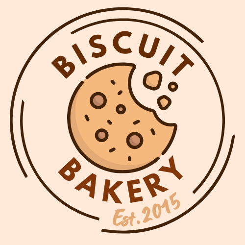
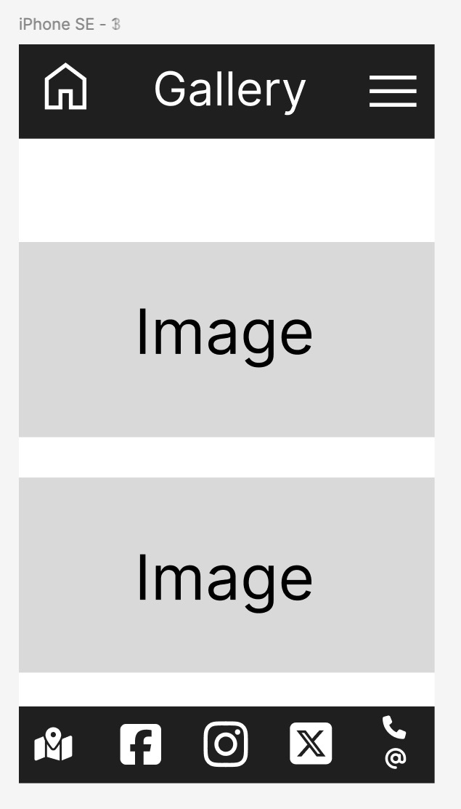

# milestone-project-1

## Description
A British biscuit bakery is commemorating its 10th year and wants to showcase their exquisite biscuit selection with a fresh new website.
They want to be able to use this to ensure potential customers (both corporate and public) know what they sell and order via an order page.
They do delivery or pick up. 

# Rationale
## Purpose 
The puspose of creating this website is to ensure the family run buisness meets the needs of its current and potential customers. They want to very much be in the 21st century and utilizing technology is a great way to achieve this. Expanding from their current address to online orders enables them to reach a wider customer base.

The users all have differing needs and wants. From fast turn-around for delivery to an easily accessible website to place orders.
Alongside a dropdown menu option for the order page, the users are taken to a new page informing them of a successful order after they place one.

The gallery images provide the users with a taste of the selection on offer and the menu makes navigation easy to use. From clearly defined sections to an easy to read font. 

This website has been made mobile friendly and scales up to accommodate larger screens. Being responsive to portrait and landscape orientations. 

The footer has much needed contact information from the location and address to the telephone number. This ensures that customers/users have a fall back option.  

---

# Contents 
1. [User story 1](#user-story-1) 
2. [User story 2](#user-story-2)
3. [User story 3](#user-story-3)
4. [User design/experience](#user-designexperience)
   1. Colour palatte for design
   2. Bootstrap code for form and table
   3. Wireframes for each display size (within each page below)
5. [Homepage](#homepage)
6. [Prices Page](#prices)
7. [Order page](#order-page)
8. [About page](#about-page)
9. [Testimonies](#testimony-page)
10. [Using Github to clone the repository](#using-github-to-clone-the-repository)
11. [Links/images used references](#linksimages-used-and-references) 
12. [Deploying the website](#deploying-the-website)

### User story 1
An estate agent wants to mark their one year anniversary of being in business by throwing a biscuit party for its workers. Profits are through the roof. They live a biscuits throw away from the bakery so can pick up a batch order when it's ready. 

### User story 2
A museum wants to showcase the British history of food and wants to give visitors an authentic experience with popular biscuits to give away.
This is one time they don’t think taking the biscuit is a bad thing.
Testimonies of the quality and being able to seamlessly order is what they need. The museum manager will be making a call for next day delivery.

### User story 3
A woman wants a selection of fine British biscuits to offer to her daughter and friends when they come round to celebrate the passing of her driving test. She is looking for an easy to navigate website to check out prices and see the gallery before she comes to pick them up.

## User design/experience
* Ensure all pages include responsive design for all screen sizes
* use Bootstrap for the order form and buttons on order page
* Wireframes for mobile, tablet and desktop!
### Colour Palette 

Bootstrap code for form and table

Wireframes for each display size

## Homepage

### Favicon
 * Use Free Fontawesome icon
### Header with logo
  

* Navigation bar (to include);
   * Images page of boxes and types of biscuits on offer
   * History of company (about page)
   * Prices page
   * Order from page (with table)
   * Testimony page

### Main Body
 Carousel with images (5-6)
> company slogan

## Footer 
* Contact Information 
   * Telephone number, address.
* Socal media Links

---
---

## Gallery

### Favicon
 * Use Free Fontawesome icon
### Header with logo
  

* Navigation bar (to include);
   * Images page of biscuits on offer
   * History of company (about page)
   * Prices page
   * Order from page (with table)
   * Testimony page

<strong>(Please note: the '*ordersuccess.html'* page is hidden from the menu as it only needs to appear once an order is actually placed)<strong>

### Main Body
 Carousel with images (5-6)
> company slogan

## Footer 
* Contact Information 
   * Telephone number, address.
* Socal media Links

---
---

## Prices

 

## Favicon
### Header with logo
  

* Navigation bar (to include);
   * Images page with types of biscuits on offer
   * History of company (about page)
   * Prices page
   * Order from page (with table)
   * Testimony page

## Main body
* Table with costs
   
   
   | Biscuit  | Size |  Cost |
   | ---      | ---  |  ---  |
   | Assortment | Large |  £15       | 
   | Choc digestive | Medium | £12   | 
   | Custard creams| Small | £8   | 
        This is a responsive table
## Footer 
* Contact Information 
   * Telephone number, address.
* Socal Media Links

---
---

## Order Page

### Favicon
### Header with logo
  

* Navigation bar (to include);
   * Images of biscuits on offer
   * History of company (about page)
   * Prices page
   * Order from page (with table)
   * Testimony page

### Main Body
 * Form with dropdown list
 * Submit button
 * Feedback response for user once submitted "successfully submitted order" or "order on its way"
 * Link back to home page 

## Footer 
* Contact Information 
   * Telephone number, address.
* Socal Media Links

---
---

## About Page

## Favicon
### Header with logo
  

* Navigation bar (to include);
   * Images page with types of biscuits on offer
   * History of company (about page)
   * Prices page
   * Order from page (with table)
   * Testimony page

### Main Body
 Carousel with images (3)
> Company Slogan

Information about loyalty scheme and rewards

## Footer 
* Contact Information 
   * Telephone number, address.
* Socal Media Links
---
---

## Testimony Page

## Favicon
### Header with logo
  

* Navigation bar (to include);
   * Images page of boxes and types of biscuits on offer
   * History of company (about page)
   * Prices page
   * Order from page (with table)
   * Testimony page

### Main Body
 Carousel with images (5-6)
> Customer quotes/reviews 

## Footer 
* Contact Information 
   * Telephone number, address.
* Socal Media Links
---

### Using Github to clone the repository
---

### Links/images used and references

---

### Deploying the website
