# milestone-project-1

## Description
A British biscuit bakery is commemorating its 10th year and wants to showcase their biscuit selection with a fresh new website.
They want to be able to use this to ensure potential customers ( both corporate and public) know what they sell and order via an order page.
They bake the classics (choc digestives and custard creams etc) as well as their own special range.
They do delivery or pick up.

### Rationale

---

# Contents 
1. [User story 1](#user-story-1) 
2. [User story 2](#user-story-2)
3. [User story 3](#user-story-3)
4. [User design/experience](#user-designexperience)
   1. Colour palatte for design
   2. Bootstrap code for form and table
   3. Wireframes for each display size (within each page below)
5. [Homepage](#homepage)
6. [Prices Page](#prices)
7. [Order page](#order-page)
8. [About page](#about-page)
9. [Testimonies](#testimony-page)
10. [Using Github to clone the repository](#using-github-to-clone-the-repository)
11. [Links/images used references](#linksimages-used-and-references) 
12. [Deploying the website](#deploying-the-website)

### User story 1
An estate agent wants to mark their one year anniversary of being in business by throwing a biscuit party for its workers. Profits are through the roof.

### User story 2
A museum wants to showcase the British history of food and wants to give visitors an authentic experience with popular biscuits to give away.
This is one time they don’t think taking the biscuit is a bad thing.
Testimonies and honest reviews are critical to get a large order.

### User story 3
A woman wants a selection of fine British biscuits to offer to her daughter and friends when they come round to celebrate her passing her driving test. Having a website to check out prices and see the quality is essential before she comes to pick them up.

## User design/experience
* Ensure all pages include responsive design for all screen sizes
* use bootstrap for the order form and buttons on order page
* Wireframes for mobile, tablet and desktop
---
Colour palatte 

Bootstrap code for form and table

Wireframes for each display size

## Homepage

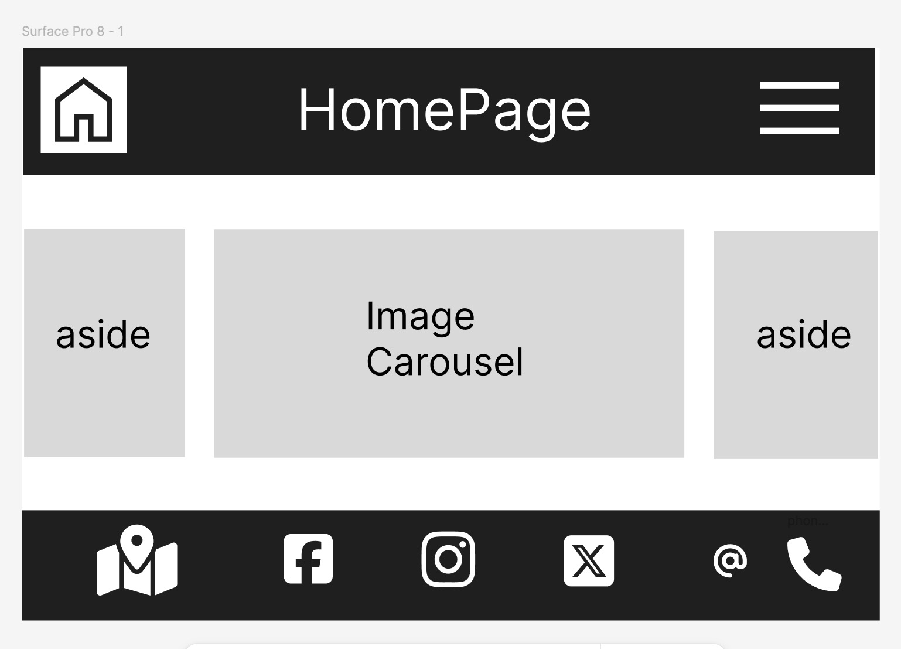
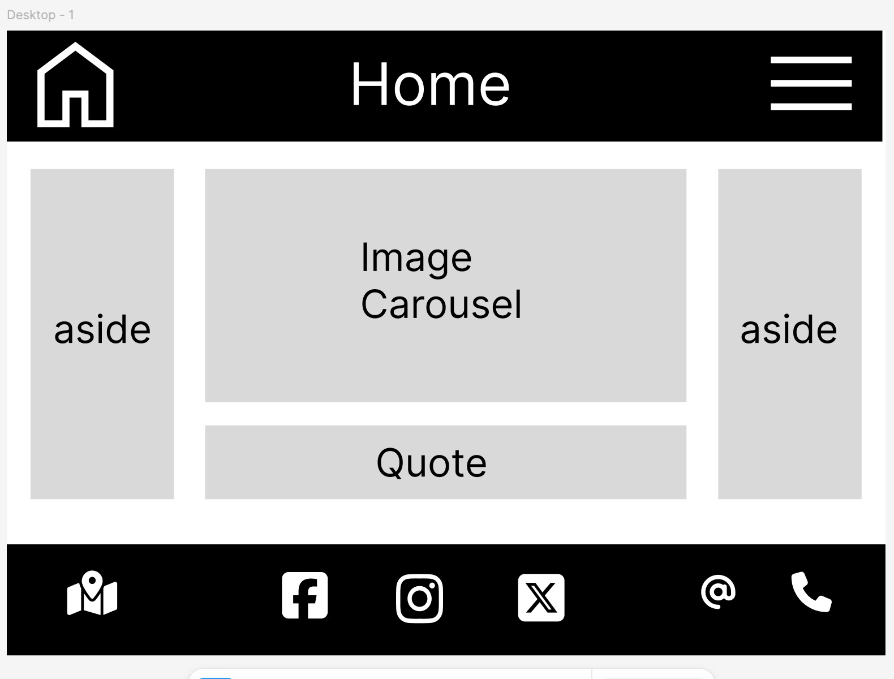

### Favicon
 * Use Free Fontawesome icon
### Header with logo
  

* Navigation bar (to include);
   * Images page of boxes and types of biscuits on offer
   * History of company (about page)
   * Prices page
   * Order from page (with table)
   * Testimony page

### Main Body
 Carousel with images (5-6)
> company slogan

## Footer 
* Contact Information 
   * Telephone number, address.
* Socal media Links

---
---

## Gallery

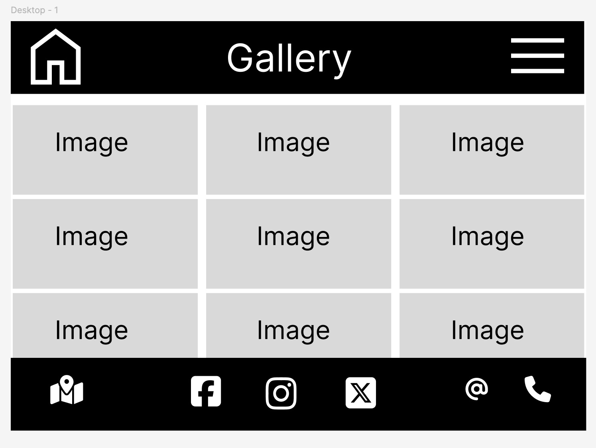
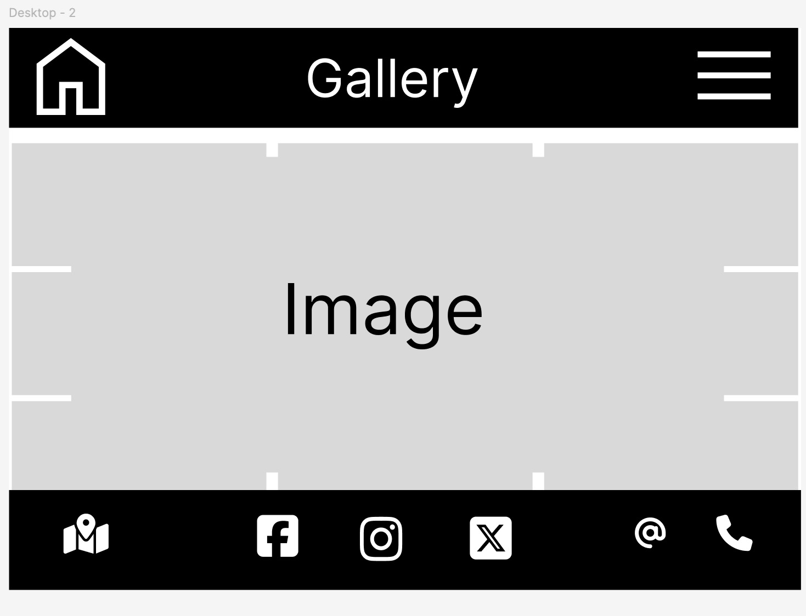

### Favicon
 * Use Free Fontawesome icon
### Header with logo
  

* Navigation bar (to include);
   * Images page of boxes and types of biscuits on offer
   * History of company (about page)
   * Prices page
   * Order from page (with table)
   * Testimony page

### Main Body
 Carousel with images (5-6)
> company slogan

## Footer 
* Contact Information 
   * Telephone number, address.
* Socal media Links

---
---

## Prices

 
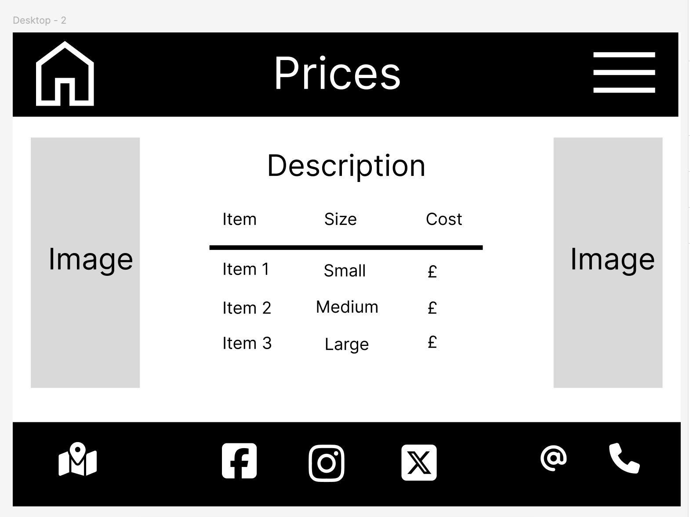

### Favicon
### Header with logo
  

* Navigation bar (to include);
   * Images page of boxes and types of biscuits on offer
   * History of company (about page)
   * Prices page
   * Order from page (with table)
   * Testimony page

## Main body
* Table with costs
   
   
   | Biscuit  | Size |  Cost |
   | ---      | ---  |  ---  |
   | Assortment | Large |  £15       | 
   | Choc digestive | Medium | £12   | 
   | Custard creams| Small | £8   | 
  

## Footer 
* Contact Information 
   * Telephone number, address.
* Socal media Links

---
---

## Order Page

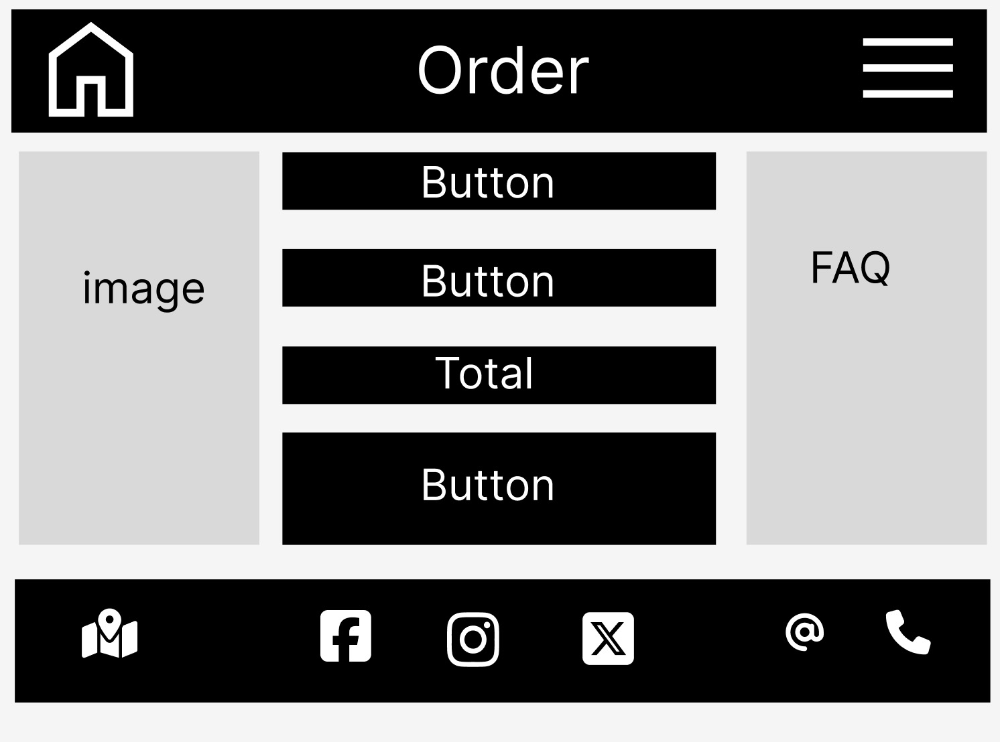
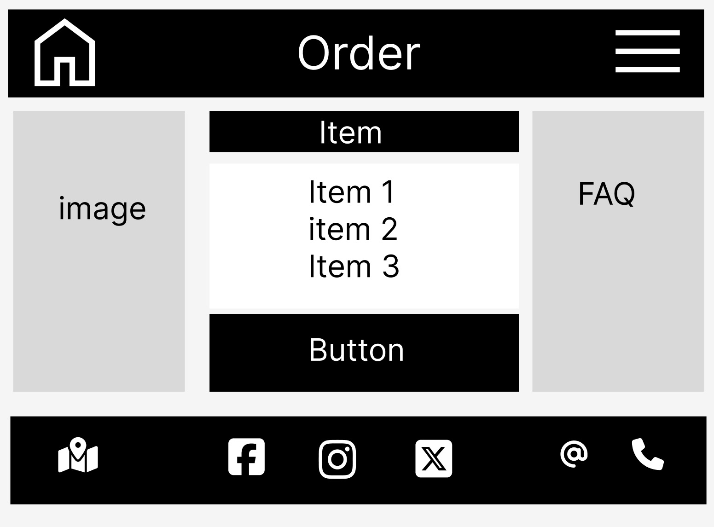
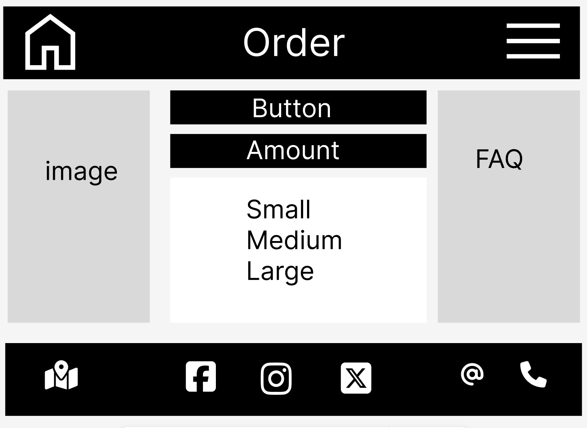
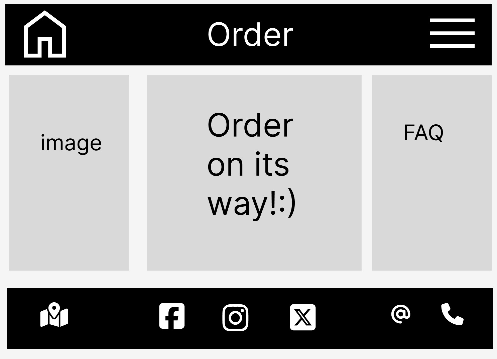

### Favicon
### Header with logo
  

* Navigation bar (to include);
   * Images page of boxes and types of biscuits on offer
   * History of company (about page)
   * Prices page
   * Order from page (with table)
   * Testimony page

### Main Body
 * Form with dropdown list
 * Submit button
 * feedback response for user once submitted "successfully submitted order" or "order on its way"
 * link back to home page 
 * short survey about users favourite biscuits ( button with dropdown list) complete to enter prize draw for a chance to win free order

## Footer 
* Contact Information 
   * Telephone number, address.
* Socal media Links

---
---

## About Page

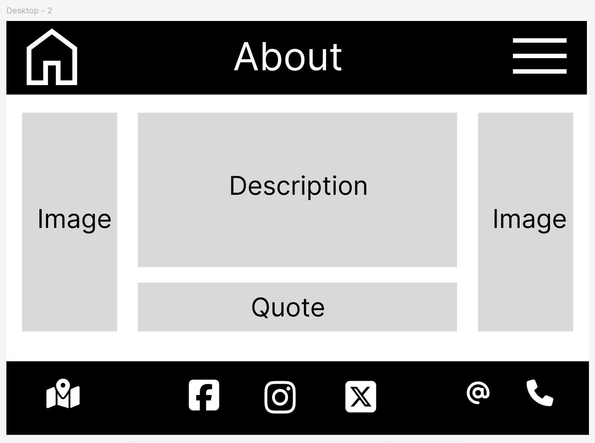

### Favicon
### Header with logo
  

* Navigation bar (to include);
   * Images page of boxes and types of biscuits on offer
   * History of company (about page)
   * Prices page
   * Order from page (with table)
   * Testimony page

### Main Body
 carousel with images (3)
> company slogan

Information about loyalty scheme and rewards

## Footer 
* Contact Information 
   * Telephone number, address.
* Socal media Links
---
---

## Testimony Page

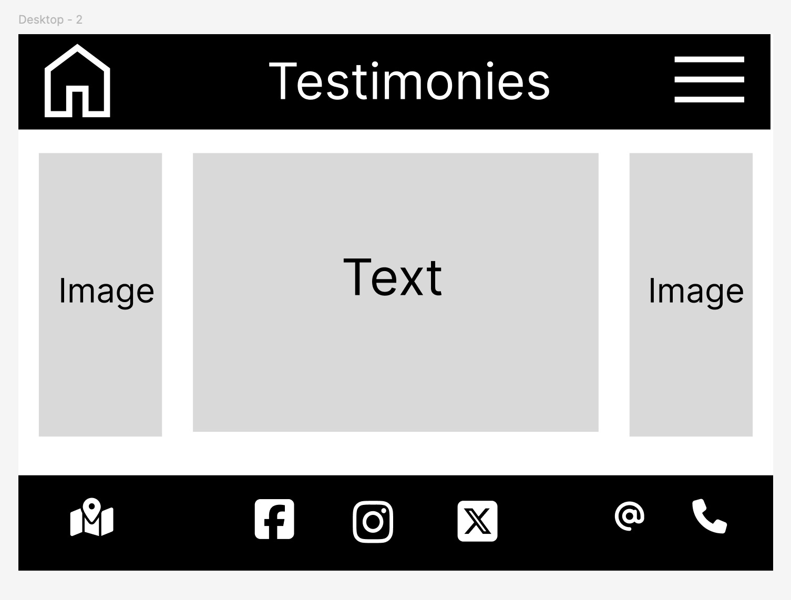

### Favicon
### Header with logo
  

* Navigation bar (to include);
   * Images page of boxes and types of biscuits on offer
   * History of company (about page)
   * Prices page
   * Order from page (with table)
   * Testimony page

### Main Body
 carousel with images (5-6)
> Customer quotes/reviews 

## Footer 
* Contact Information 
   * Telephone number, address.
* Socal media Links
---
---

### Using Github to clone the repository
---

### Links/images used and references

---

### Deploying the website